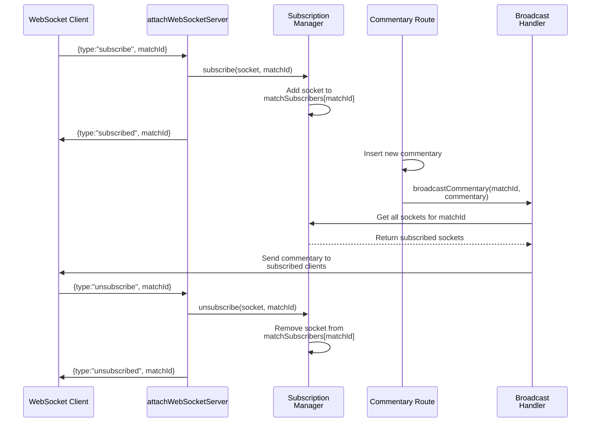

# Pub/Sub Architecture

```mermaid
sequenceDiagram
    participant Client as WebSocket Client
    participant Server as attachWebSocketServer
    participant SubMgr as Subscription<br/>Manager
    participant Route as Commentary Route
    participant Broadcast as Broadcast<br/>Handler

    Client->>Server: {type:"subscribe", matchId}
    Server->>SubMgr: subscribe(socket, matchId)
    SubMgr->>SubMgr: Add socket to<br/>matchSubscribers[matchId]
    Server->>Client: {type:"subscribed", matchId}

    Route->>Route: Insert new commentary
    Route->>Broadcast: broadcastCommentary(matchId,<br/>commentary)
    Broadcast->>SubMgr: Get all sockets for matchId
    SubMgr-->>Broadcast: Return subscribed sockets
    Broadcast->>Client: Send commentary to<br/>subscribed clients

    Client->>Server: {type:"unsubscribe", matchId}
    Server->>SubMgr: unsubscribe(socket, matchId)
    SubMgr->>SubMgr: Remove socket from<br/>matchSubscribers[matchId]
    Server->>Client: {type:"unsubscribed", matchId}
```
